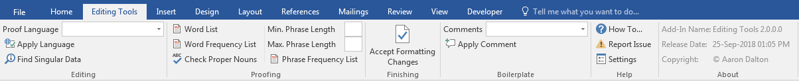

# Editing Tools

This VSTO Add-In is used for various editing and/or proofing tools including: one-click language applicator, "singular data" finder, word list generator, word frequency generator, proper noun discrepancy checker, one-click "accept formatting changes," and comment(s) manager. I'm currently migrating the functionality from the ribbon Visual Designer to XML.

<h1 align="left">
  
</h1>

## Table of Contents
- <a href="#install">Install</a>
- <a href="#dependencies">Dependencies</a>
- <a href="#glossary-of-terms">Glossary of Terms</a>
- <a href="#functionality">Functionality</a> 
    - <a href="#about">About</a>

 

## Install
Instructions for installation of VSTO version...

### VSTO
How to install the VSTO version

## Dependencies
|Software                                   |Dependency                 |Project                    |
|:------------------------------------------|:--------------------------|:--------------------------|
|[Microsoft Visual Studio Community 2017](https://www.visualstudio.com/vs/whatsnew/)|Solution|VSTO|
|[Microsoft Office Developer Tools](https://visualstudio.microsoft.com/vs/features/office-tools/)|Solution|VSTO|
|[Microsoft Word 2010 (or later)](https://www.microsoft.com/en-au/software-download/office)|Project|VSTO|
|[Extensible Markup Language (XML)](https://docs.microsoft.com/en-us/visualstudio/vsto/ribbon-xml?view=vs-2017)|Ribbon|VSTO|
|[Log4Net](https://www.nuget.org/packages/log4net/) |Error Logging |VSTO|
|[ScreenToGif](http://www.screentogif.com/)|Read Me|VSTO|
|[Snagit](http://discover.techsmith.com/snagit-non-brand-desktop/?gclid=CNzQiOTO09UCFVoFKgod9EIB3g)|Read Me|VSTO|
|Badges ([Library](https://shields.io/), [Custom](https://rozaxe.github.io/factory/), [Star/Fork](http://githubbadges.com))|Read Me|VSTO|

 

## Glossary of Terms

| Term                      | Meaning                                                                                  |
|:--------------------------|:-----------------------------------------------------------------------------------------|
| COM |Component Object Model (COM) is a binary-interface standard for software components introduced by Microsoft in 1993. It is used to enable inter-process communication and dynamic object creation in a large range of programming languages. COM is the basis for several other Microsoft technologies and frameworks, including OLE, OLE Automation, ActiveX, COM+, DCOM, the Windows shell, DirectX, UMDF and Windows Runtime.  |
| HTML|Hypertext Markup Language is the standard markup language for creating web pages and web applications|
| VSTO |Visual Studio Tools for Office (VSTO) is a set of development tools available in the form of a Visual Studio add-in (project templates) and a runtime that allows Microsoft Office 2003 and later versions of Office applications to host the .NET Framework Common Language Runtime (CLR) to expose their functionality via .NET.|
| XML|Extensible Markup Language (XML) is a markup language that defines a set of rules for encoding documents in a format that is both human-readable and machine-readable.The design goals of XML emphasize simplicity, generality, and usability across the Internet. It is a textual data format with strong support via Unicode for different human languages. Although the design of XML focuses on documents, the language is widely used for the representation of arbitrary data structures such as those used in web services.|

 

## Functionality
This Word ribbon is inserted after the “Home” tab when the application opens. Listed below is the detailed functionality of this application and its components.

The language applicator applies the language to *all* text, including notes, headers, and footers. Text boxes and frames may be skipped. I haven't done extensive testing around those.

The proper noun checker looks for proper nouns that sound similar or that differ by a customizeable editing distance. Useful for catching common typos in names.

The word list generator creates an alphabetized list of all the unique words in the document. Useful for proofreading.

If you find yourself making the same comments over and over, the boilerplate manager can save you some time. The export/import features lets you share comment boilerplate with others or move them between machines.

If you have suggestions for new tools, or if you have any questions, let me know.

## "Real" Editing Tools

Do *not* confuse this with the most excellent ["Edit Tools" by wordsnSync](http://www.wordsnsync.com/). Also check out [PerfectIt](http://www.intelligentediting.com/) and [the Editorium](http://www.editorium.com/). If you're looking for macros instead of plugins, check out [Paul Beverly's excellent book of macros](http://www.archivepub.co.uk/book.html).

## Disclaimers

I can't guarantee that this code will work in your version of Visual Studio or Word. Microsoft does not make that sort of maintainability easy!

I'm just sharing this because a couple people asked for the code. If you find it useful, great!

If you just want to see the algorithms, then you'll be most interested in the files `Ribbon1.cs` (which contains the code that runs when you click a ribbon button and describes the overall algorithms) and `TextHelpers.cs` (which contains all the little helper functions that make writing the algorithms easier).
